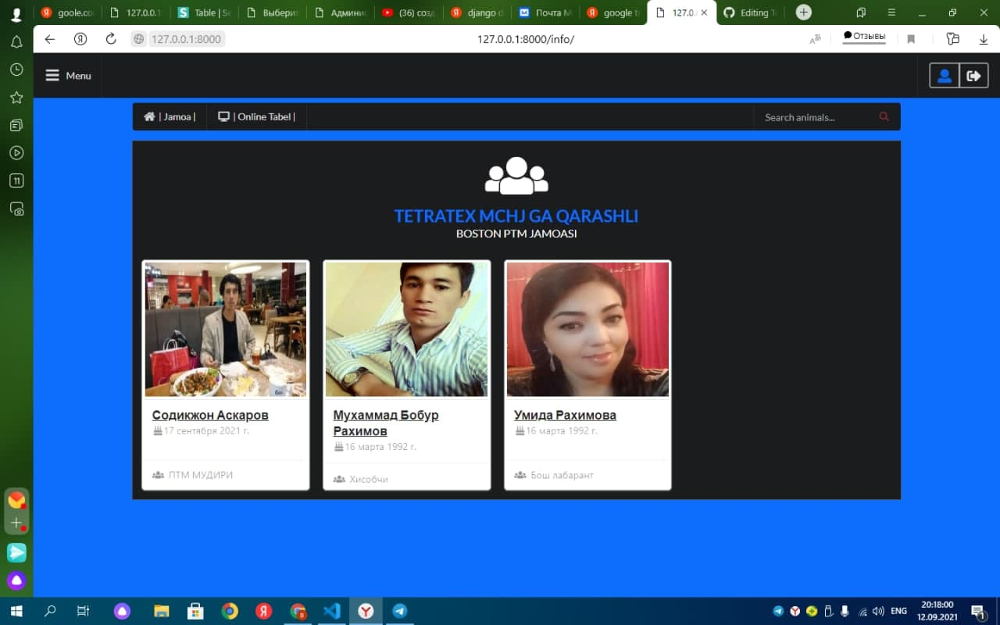
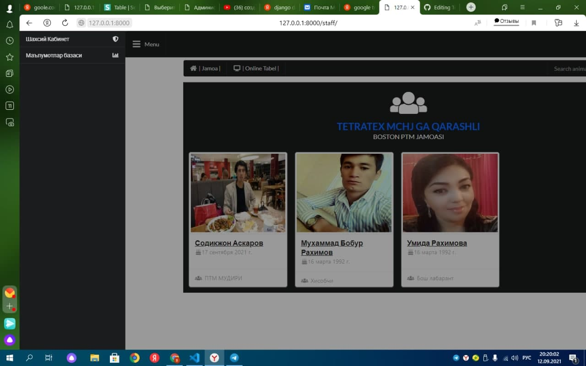

# 1. Tetratex-mchj
# 2. This project is a ClasterCotton

## 2.1. **Install:**

`pip install django`
`pip install pillow`

### 2.1.1. APPS:
- authorization
- info
- form
 ........................

# authorization app
  `bunda korxonaning filiali bugalterinig aloxida login va passwordi bo'ladi va har-bir filial bugalteri o'zining kunlik malumot larini tushurib boradi. barcha filial malumotlari yigilib boriladi `  

# info app
  `bu info appi barcha kiritilgan malumotlarni ko'rish bo'limi bo'lib bunda korxonaning filiali da ishlayabturgan barcha ishchilarning va hodimlarning malumotlari hamda ishga kelib ketish, ro'yhati bilan  tanish va korish mumkun.hodim va ishchilarning o'zi ham kirib qancha oylik ishlanyabturganini ko'rish mumkun.` 

  
